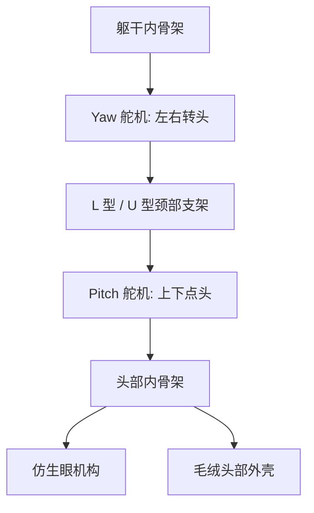

# 熊猫花花 Demo 基础硬件 BOM 报价表

版本：V1.0  
日期：2026-06-10  
口径：仅硬件采购成本，不含结构设计费、装配费、调试费、软件开发费、拍摄费、IP 授权、认证、开模

## 1. 报价结论

按淘宝常见零售件估算，初期 Demo 基础硬件建议预算：

| 方案 | 硬件成本 | 说明 |
|---|---:|---|
| 最低可跑通版 | 约 1,000-1,300 元 | 能跑通眨眼、点头、摸头触发、挥手、语音播放，但外观和稳定性余量较小 |
| 推荐基础 Demo 版 | 约 1,500-1,800 元 | 推荐给当前阶段使用，头部舵机、眼部结构、电源和备件留有余量 |
| 稍稳妥备件版 | 约 2,000-2,500 元 | 多备舵机、线材、结构件，适合首台样机反复拆装 |

建议给投资人展示硬件口径时写：

> 首台 Demo 的基础硬件采购成本约 1,500-2,000 元；该金额只包含淘宝常见模块和结构材料，不包含人工装配、动作调试、外观修整、软件联调和演示视频制作。

## 2. 基础硬件 BOM

| 编号 | 模块 | 淘宝搜索关键词 | 建议型号 / 规格 | 数量 | 参考单价 | 小计 | 是否必须 | 备注 |
|---:|---|---|---|---:|---:|---:|---|---|
| 1 | 毛绒外壳 | 大号熊猫毛绒玩具 50cm 花花 | 45-60cm，头部空间大，背部可开口 | 1 | 260 | 260 | 是 | 头部空间优先，不要只看外观 |
| 2 | 主控板 | ESP32-S3 开发板 小智 AI | ESP32-S3 N16R8 / 小智兼容板 | 1 | 120 | 120 | 是 | 用于语音、事件和动作控制 |
| 3 | 舵机驱动 | PCA9685 16路 舵机驱动板 IIC | PCA9685 16CH PWM 模块 | 1 | 20 | 20 | 是 | 统一驱动眼、头、手舵机 |
| 4 | 眼部舵机 | 1.7g 舵机 3.7g 舵机 SG90 | 3.7g 微型舵机，180 度 | 6 | 18 | 108 | 是 | 仿生眼球和眼皮 |
| 5 | 仿生眼结构 | Cogley 仿生眼 3D打印 代打 | 双眼机构打印件 + 眼球件 | 1 | 220 | 220 | 是 | 可用开源 STL 代打印 |
| 6 | 头部舵机 | DS3218 20KG 数字舵机 金属齿 | DS3218 / 20kg 数字金属齿舵机 | 2 | 45 | 90 | 是 | 头部 yaw / pitch，建议比 MG90S 更大扭矩 |
| 7 | 头部支架 | 二自由度云台 舵机支架 3D打印 | 舵机云台 / 自制颈部支架 | 1 | 80 | 80 | 是 | 可 3D 打印或亚克力加工 |
| 8 | 前肢舵机 | MG90S 金属齿 舵机 | MG90S / 9g 金属齿，180 度 | 2 | 18 | 36 | 是 | 左右前肢各 1 个，最低可先只装右手 |
| 9 | 前肢传动 | 舵机连杆 球头 拉杆 M2 M3 | 舵机臂 + 连杆 + 球头 | 1 | 40 | 40 | 是 | 做轻挥手，不做抓取 |
| 10 | 触摸传感 | TTP223 触摸模块 电容触摸 | TTP223 点动型模块 | 1 | 5 | 5 | 是 | 只布置头部触摸 |
| 11 | 麦克风 | INMP441 I2S 麦克风模块 | INMP441 | 1 | 8 | 8 | 推荐 | 若主控板自带麦克风可省 |
| 12 | 功放 | MAX98357A I2S 功放模块 | MAX98357A 3W | 1 | 12 | 12 | 推荐 | 若主控板自带功放可省 |
| 13 | 扬声器 | 4欧3瓦 扬声器 小喇叭 | 4Ω 3W，直径 40mm 左右 | 1 | 10 | 10 | 是 | 藏在身体内部 |
| 14 | 电源 | 5V5A 电源适配器 DC | 5V 4A / 5A 外接电源 | 1 | 35 | 35 | 是 | Demo 优先外接供电 |
| 15 | 电源保护 | DC-DC 降压模块 开关 保险丝 | 降压模块 + 船型开关 + 保险 | 1 | 25 | 25 | 是 | 减少舵机拉电导致重启 |
| 16 | 内骨架 | 3D打印 舵机支架 亚克力支架 | PLA / 亚克力 / 铝条混合 | 1 | 200 | 200 | 是 | 固定头部、主板和前肢 |
| 17 | 线材端子 | 杜邦线 JST 舵机延长线 热缩管 | 舵机延长线、端子、排线 | 1 | 60 | 60 | 是 | 首台样机线材要多备 |
| 18 | 紧固件 | M2 M3 螺丝 铜柱 螺母 垫片 | M2/M3 混合包 | 1 | 50 | 50 | 是 | 眼部、支架、主板固定 |
| 19 | 外观辅料 | 拉链 魔术贴 海绵 热熔胶 | 隐藏拉链、海绵、胶、扎带 | 1 | 80 | 80 | 是 | 用于外壳复原和遮挡机械 |
| 20 | 备件 | SG90 MG90S 舵机 备用 | 舵机、线材、接头备件 | 1 | 60 | 60 | 推荐 | 首台调试容易损坏舵机 |
|  |  |  | **推荐基础硬件合计** |  |  | **1,519** |  |  |

## 3. 可删减项

预算紧张时，可按下面顺序删减：

| 可删减项 | 可节省 | 影响 |
|---|---:|---|
| 左前肢舵机，只保留右手挥手 | 18-40 元 | 动作少一点，但不影响核心演示 |
| INMP441 麦克风 | 8-20 元 | 只做预置语音时可以省 |
| MAX98357A 功放 | 12-30 元 | 主控板若自带功放可以省 |
| 备件 | 60-150 元 | 不建议省，首台样机容易坏件 |
| 眼球 X/Y 两个舵机 | 36-80 元 | 只保留眨眼，眼神亮点会弱很多 |

## 4. 头部驱动方案

### 4.1 推荐方案：双舵机二自由度头部

| 自由度 | 作用 | 推荐舵机 | 安装方式 |
|---|---|---|---|
| Yaw 左右转头 | 看向左 / 右 / 正前方 | DS3218 20kg 数字金属齿舵机 | 安装在躯干上方，带动整个头部左右转 |
| Pitch 上下点头 | 点头 / 低头 / 抬头 | DS3218 20kg 或 15kg 金属齿舵机 | 安装在颈部支架第二层，带动头部俯仰 |

建议不要用 MG90S 承担整个头部转动。熊猫头部装入眼部机构、毛绒和支架后会明显变重，MG90S 容易抖、发热、无力。头部建议直接用 15-20kg 级数字金属齿舵机。

### 4.2 结构建议

### 4.3 控制建议

| 动作 | 舵机组合 | 角度建议 |
|---|---|---|
| 看向正前方 | Yaw 回中，Pitch 回中 | 90 度附近，按实物标定 |
| 轻微看左 / 右 | Yaw 左右偏转 | 左右各 20-30 度 |
| 点头回应 | Pitch 下压后回中 | 10-15 度小幅动作 |
| 摸头回应 | 眨眼 + Pitch 点头 + Yaw 轻偏 | 动作要慢，不要突然甩头 |

## 5. 前肢 / 手部驱动方案

### 5.1 推荐方案：单舵机轻挥手

本期 Demo 不做抓取、不做抱竹子、不做复杂手臂关节，只做“抬起 - 轻挥 - 放下”。

| 部位 | 推荐舵机 | 数量 | 动作 |
|---|---|---:|---|
| 右前肢 | MG90S 金属齿 9g 舵机 | 1 | 抬手、挥手、放下 |
| 左前肢 | MG90S 金属齿 9g 舵机 | 1 | 可同步轻动，也可先不启用 |

### 5.2 机械结构

### 5.3 安装建议

| 项目 | 建议 |
|---|---|
| 舵机位置 | 躯干肩部内侧，不建议直接塞在手掌末端 |
| 传动方式 | 舵机臂 + 短连杆 / 钢丝拉动前肢 |
| 动作幅度 | 抬起约 30-50 度，挥动约 10-20 度 |
| 动作速度 | 慢速缓动，避免机械感 |
| 外观处理 | 前肢内部加轻质塑料片或软骨架，外部保持毛绒蓬松 |

### 5.4 可选增强：双自由度前肢

如果后续预算允许，可升级为每只前肢 2 个舵机：

| 自由度 | 作用 | 是否本期需要 |
|---|---|---|
| 肩部抬起 | 抬手 / 放下 | 本期需要 |
| 肩部内外摆 | 招手 / 作揖 | 后续增强 |

本期建议先做单自由度，因为投资人演示只要能看到“花花在回应并挥手”，复杂手臂结构会增加调试风险。

## 6. 型号选择建议

| 用途 | 不推荐 | 推荐 | 原因 |
|---|---|---|---|
| 头部 yaw / pitch | MG90S / SG90 | DS3218 20kg 或同级 | 头部重，需要扭矩余量 |
| 前肢挥手 | SG90 塑料齿 | MG90S 金属齿 | 金属齿更耐拆装 |
| 眼皮 / 眼球 | 大扭矩舵机 | 1.7g / 3.7g 微型舵机 | 头部空间有限，动作负载小 |
| 舵机驱动 | 直接接 ESP32 多路 PWM | PCA9685 16 路 | 接线简单，通道足够 |
| 供电 | ESP32 USB 口直供舵机 | 独立 5V 4A/5A 电源 | 舵机启动电流大，直供容易重启 |

## 7. 下单备注

1. 淘宝价格浮动较大，同一型号不同店铺会因是否包邮、是否原装、是否带线材而差异明显。
2. 舵机建议多买 2-3 个备用，首台样机标定时容易堵转或烧齿。
3. 头部舵机不要只看便宜，扭矩不足会直接影响演示效果。
4. 眼部 3D 打印件建议一次打印两套关键小件，眼皮连杆容易断。
5. 电源一定要给舵机独立供电，并与 ESP32 共地。

## 8. 价格参考说明

淘宝商品页通常不稳定且公开检索不完整，本表按淘宝常见模块搜索词进行估算，并交叉参考京东 / 厂商公开页面确认品类与规格：

- 京东可检索到 SG90 / MG90S 舵机相关商品与报价行情页面。
- 京东可检索到 PCA9685 16 路舵机驱动板商品列表。
- 京东可检索到 TTP223 触摸传感器商品列表。
- Adafruit PCA9685 官方页面可作为原版模块价格和规格参考。
- MG90S 公开商品页常见规格为 13.6g 左右、约 2.0kg 扭矩、180 度转角，适合作为前肢小动作舵机参考。
