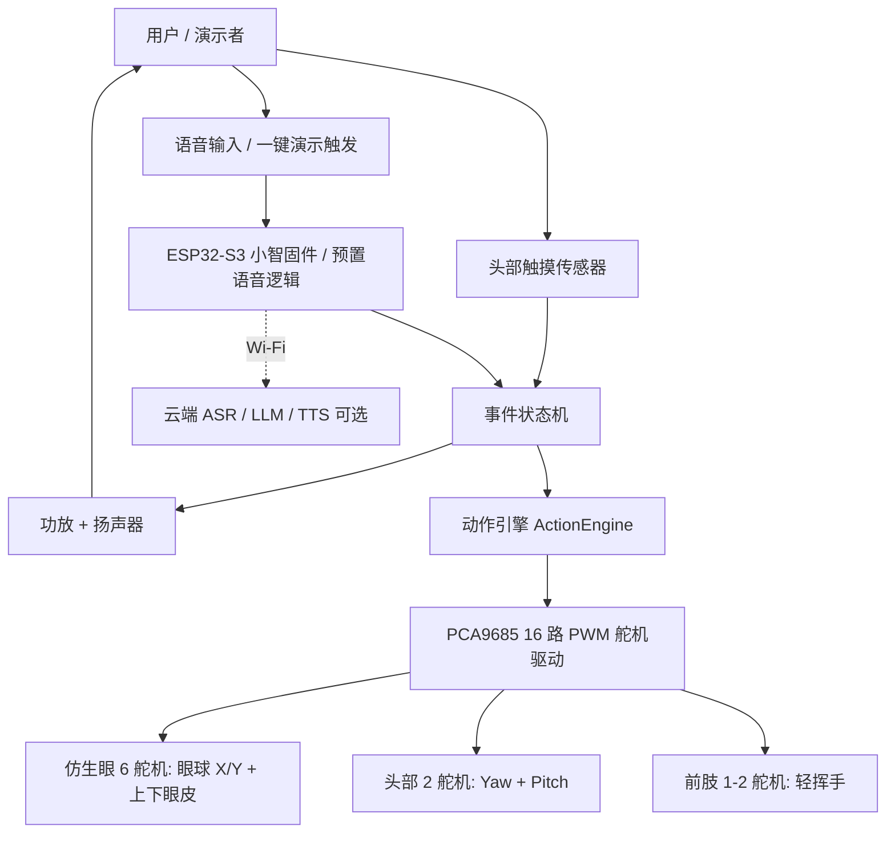
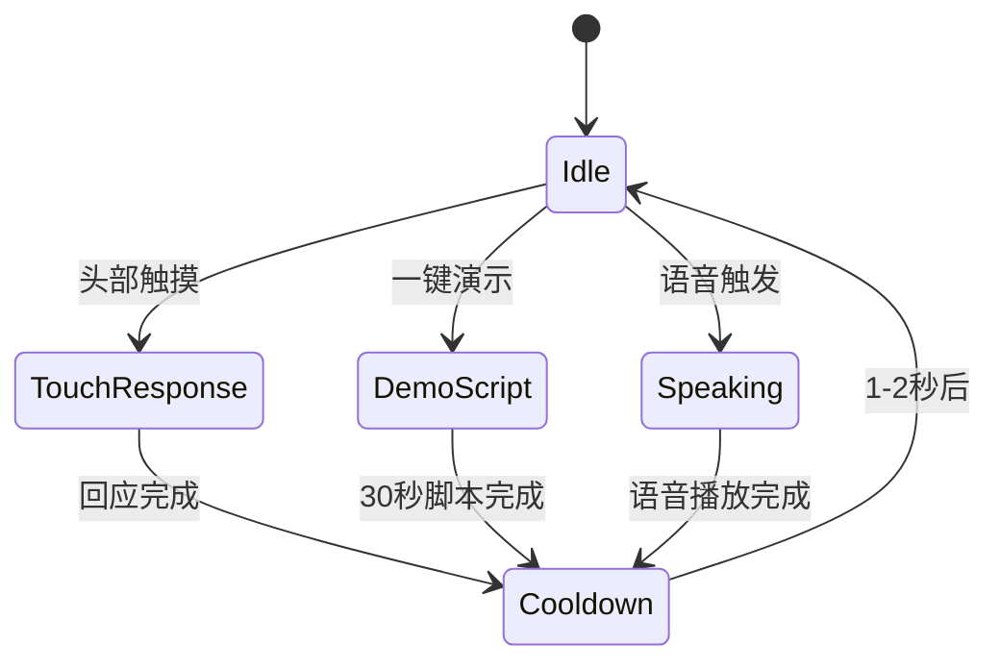
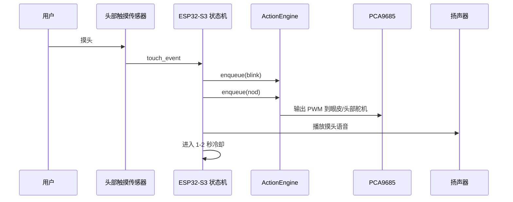

# 熊猫花花仿生机器人 Demo 系统设计文档

版本：V1.0  
日期：2026-06-10  
关联 PRD：[biomimetic-panda-robot-prd.md](./biomimetic-panda-robot-prd.md)  
适用阶段：初期 Demo PoC / 投资人演示样机

## 1. 设计目标

本系统设计只服务当前 Demo，不定义完整量产产品。

本期 Demo 的核心目标是：

> 用现成熊猫毛绒外壳 + 小智 ESP32 对话方案 + PCA9685 舵机驱动 + 开源仿生眼机构，尽快做出一只 30 秒内能展示“会眨眼、会点头、摸头有回应、能说话、能挥手”的熊猫花花样机。

### 1.1 本期必须验证

| 验证项 | 目标 |
|---|---|
| 外观识别 | 观众第一眼能识别为熊猫花花方向 |
| 头眼联动 | 能眨眼、点头、轻微转头 |
| 摸头回应 | 摸头后形成“眨眼 + 点头 / 轻转头 + 短语音”的明确反馈 |
| 前肢动作 | 至少完成 1 个轻挥手动作 |
| 结构空间 | 眼部机构、主板、驱动、线束能装入毛绒熊猫内部 |
| 演示复现 | 30 秒主演示流程可重复 3-5 次 |

### 1.2 本期不解决

| 不做项 | 说明 |
|---|---|
| 下肢动作 / 行走 | 下肢静态，不做爬行、行走、站立 |
| 抱起体验 | 不考虑被抱起后的强度、跌落、耐摔 |
| 多区域触摸 | 只做头部触摸，不做背部、腹部、前肢触摸 |
| 完整 AI 问答验收 | AI 对话可作为增强，但 Demo 可以用预置语音兜底 |
| 长时间连续运行 | 不做 2 小时连续运行测试 |
| 完整安全认证 | 不做儿童玩具认证、安规认证、量产合规 |
| 量产结构定型 | 不做开模级结构和最终材料确认 |

## 2. 总体技术路线

沿用项目既有调研结论，采用“成熟方案拼装 + 少量动作脚本”的 Demo 路线：

| 模块 | 技术路线 | 采用原因 |
|---|---|---|
| 外壳 | 现成大号熊猫毛绒玩具改造 | 降低外观、缝制和拟真成本 |
| 对话 / 语音 | 小智 xiaozhi-esp32 或预置语音播放 | 快速跑通语音链路，支持后续大模型 |
| 运动控制 | ESP32-S3 + PCA9685 16 路舵机板 | I2C 驱动多路舵机，接线简单 |
| 眼部机构 | Will Cogley / Nilheim 类 6 舵机仿生眼机构 | 已验证的眼球 + 眼皮方案 |
| 头部动作 | 2 个舵机：左右转头 + 上下点头 | 满足最小生命感 |
| 前肢动作 | 1-2 个金属齿微型舵机 | 完成挥手演示即可 |
| 触摸 | 头部电容触摸或薄膜压力传感器 | 只保留最关键互动入口 |
| 演示控制 | 一键演示 + 串口/遥控兜底 | 降低现场演示风险 |

## 3. 系统架构

### 3.1 分层说明

| 层级 | 责任 | 本期实现 |
|---|---|---|
| 外观结构层 | 毛绒外壳、内骨架、眼部安装、维修口 | 现成玩偶改造 + 3D 打印支架 |
| 执行器层 | 眼睛、头部、前肢舵机 | PCA9685 统一输出 PWM |
| 小脑控制层 | 舵机限位、缓动、动作关键帧 | 复用 `dev/xiaozhi-mcp` 动作骨架 |
| 事件编排层 | 摸头、语音、一键演示的状态机 | 固定 30 秒演示脚本 |
| 语音交互层 | 预置语音播放 / 小智对话 | Demo 可先用预置语音，增强版接小智 |
| 云端增强层 | ASR、LLM、TTS、人设 Prompt | 可选，不阻塞 Demo 主链路 |

## 4. 硬件设计

### 4.1 主控与舵机驱动

| 项目 | 推荐方案 | 说明 |
|---|---|---|
| 主控 | ESP32-S3 小智兼容开发板 | 运行小智固件、事件状态机、动作工具 |
| 舵机驱动 | PCA9685 16 路 PWM 驱动板 | I2C 连接 ESP32-S3，统一驱动眼、头、前肢 |
| 音频输入 | INMP441 / 板载麦克风 | 若只做预置语音，可先不强依赖麦克风 |
| 音频输出 | MAX98357A + 3W 扬声器 | 播放欢迎、摸头回应、科普短语音 |
| 触摸输入 | TTP223 电容触摸 / 薄膜压力传感器 | 只布置头部触摸 |
| 供电 | 5V 4A USB 电源适配器 | Demo 优先外接供电，不先做电池 |

### 4.2 舵机通道规划

沿用当前代码中的 PCA9685 通道映射，Demo 可以先启用 10 路，保留 1 路腰部或备用。

| PCA9685 通道 | 关节 | 本期用途 | 是否必须 |
|---|---|---|---|
| 0 | EYE_X | 双眼左右扫视 | 推荐 |
| 1 | EYE_Y | 双眼上下扫视 | 推荐 |
| 2 | EYELID_TL | 左上眼皮 | 必须 |
| 3 | EYELID_TR | 右上眼皮 | 必须 |
| 4 | EYELID_BL | 左下眼皮 | 推荐 |
| 5 | EYELID_BR | 右下眼皮 | 推荐 |
| 6 | HEAD_PITCH | 上下点头 | 必须 |
| 7 | HEAD_YAW | 左右转头 | 必须 |
| 8 | ARM_L | 左前肢 | 可选 |
| 9 | ARM_R | 右前肢挥手 | 必须 |
| 10 | WAIST | 腰部 / 备用 | 本期默认不启用 |

说明：如果头部空间紧张，可以先保留眼皮眨眼 + 头部转向，把眼球 X/Y 作为第二轮调试项；但投资人演示更建议保留 6 舵机仿生眼，因为这是差异化亮点。

### 4.3 结构布局

| 区域 | 内部组件 | 设计要点 |
|---|---|---|
| 头部 | 仿生眼机构、眼皮舵机、头部触摸传感器、部分线束 | 先保证眼睛装得下，再调脸部比例 |
| 颈部 | 头部 yaw / pitch 舵机或二自由度支架 | 需要承受头部重量，优先用金属齿舵机 |
| 躯干 | ESP32-S3、PCA9685、电源模块、扬声器 | 背部留隐藏拉链，便于维护和调试 |
| 前肢 | 1-2 个舵机、连杆、软包覆 | 只做轻挥手，不做抓取和抱竹子 |
| 底部 / 展台 | 外接电源入口、演示开关 | 投资人演示建议用展台遮挡电源线 |

## 5. 软件设计

### 5.1 软件模块

| 模块 | 位置 | 职责 |
|---|---|---|
| `ServoBus` | `dev/xiaozhi-mcp/panda_servos.*` | PCA9685 初始化、角度限位、缓动控制 |
| `ActionEngine` | `dev/xiaozhi-mcp/panda_actions.*` | 眨眼、点头、看向、挥手等关键帧动作 |
| `MCP Tools` | `dev/xiaozhi-mcp/panda_mcp_tools.*` | 将动作注册为小智可调用工具 |
| 裸测 REPL | `dev/panda-servo-demo/` | 不接大模型，串口调试舵机和动作 |
| Demo 状态机 | 待实现 / 集成到固件 | 编排待机、摸头回应、挥手、冷却 |
| 语音播放 | 小智固件或本地音频播放 | 预置 5-8 条 Demo 语音 |

### 5.2 事件状态机

| 状态 | 行为 |
|---|---|
| Idle | 随机眨眼，偶尔轻微转头 |
| TouchResponse | 眨眼 + 点头 / 轻转头 + 播放摸头回应语音 |
| DemoScript | 按 30 秒主演示脚本依次触发动作 |
| Speaking | 播放语音，可提高眨眼频率 |
| Cooldown | 避免连续触摸造成动作堆积 |

### 5.3 30 秒 Demo 脚本

| 时间 | 动作指令 | 语音 / 表现 |
|---|---|---|
| 0-5 秒 | `idle on` / 随机 blink | 熊猫静坐，轻微眨眼 |
| 5-10 秒 | `look front` | 看向演示者 |
| 10-18 秒 | 摸头事件触发 `blink + nod` | “嘿嘿，好舒服。” |
| 18-25 秒 | `wave 2` | “我跟大家打个招呼。” |
| 25-30 秒 | `look front + relax` | 回到待机姿态 |

### 5.4 预置语音

Demo 阶段建议 5-8 条即可：

| 场景 | 文案 |
|---|---|
| 开场 | “你好呀，我是花花。” |
| 欢迎 | “欢迎来看我。” |
| 摸头 | “嘿嘿，好舒服。” |
| 挥手 | “我跟大家打个招呼。” |
| 科普 | “我是大熊猫，最喜欢吃竹子。” |
| 待机 | “我有一点点困啦。” |

## 6. 数据与控制流

### 6.1 摸头回应链路

### 6.2 对话触发动作链路

增强版可接入小智与大模型：

1. 用户说“花花，跟大家挥挥手”。
2. 小智完成唤醒、ASR、LLM 意图理解。
3. LLM 或规则触发 MCP 工具 `self.panda.wave`。
4. MCP 回调只把动作投递给 `ActionEngine`，立即返回，不阻塞语音。
5. `ActionEngine` 播放挥手关键帧。

Demo 兜底方案：如果现场网络不稳，使用隐藏按键或遥控直接触发同一套动作和预置语音。

## 7. 接口定义

| 接口 | 连接 | 说明 |
|---|---|---|
| I2C | ESP32-S3 `SDA/SCL` -> PCA9685 `SDA/SCL` | 默认地址 `0x40` |
| PWM | PCA9685 CH0-CH10 -> 各舵机 | 50Hz，角度需实物标定 |
| GPIO | ESP32-S3 -> 触摸模块 | 头部触摸输入 |
| I2S | ESP32-S3 -> 麦克风 / 功放 | 语音输入输出 |
| 5V Power | 外接电源 -> PCA9685 V+ / 功放 / 主控降压 | 舵机电源必须与主控共地 |
| USB / UART | PC -> ESP32-S3 | 裸测、烧录、串口标定 |

## 8. 调试与验收

### 8.1 调试顺序

1. 单独刷写小智或 ESP32-S3 裸测固件，确认主控可运行。
2. 连接 PCA9685，确认 I2C 地址与 PWM 输出。
3. 每个舵机单独 `sweep`，确认无堵转、无卡滞。
4. 回填每个关节的 `min / center / max` 标定值。
5. 跑通 `blink / nod / wave / look front`。
6. 接入头部触摸，跑通“摸头 -> blink + nod + voice”。
7. 装入毛绒熊猫外壳，复测动作是否被毛绒干涉。
8. 录制 30 秒 Demo 视频，作为投资人演示兜底。

### 8.2 Demo 验收标准

| 维度 | 通过标准 |
|---|---|
| 结构 | 眼部、主控、驱动、线束可装入，不明显破坏熊猫外观 |
| 眼部 | 能完成眨眼，视频中可见 |
| 头部 | 能点头和轻微转头，无明显卡滞 |
| 触摸 | 摸头后 500ms 左右出现可感知反馈 |
| 语音 | 可清晰播放 5-8 条预置语音 |
| 前肢 | 至少完成 1 个挥手动作 |
| 演示 | 30 秒脚本可重复 3-5 次 |

## 9. 风险与对策

| 风险 | 影响 | 对策 |
|---|---|---|
| 眼机构塞不进头部 | 外观比例失控 | 先选头部更大的玩偶，至少做结构优先版和外观协调版两套比例 |
| 舵机噪音大 | 破坏生命感 | 选金属齿/数字舵机，动作加缓动，演示环境加背景声 |
| 毛绒干涉眼皮 | 眨眼失败 | 眼眶周边留硬质边界或薄壳支撑 |
| 头部过重 | 点头无力或抖动 | 头部舵机升级，主控和电源尽量放躯干 |
| 网络不稳定 | AI 对话失败 | 保留预置语音、一键演示、遥控兜底 |
| 动作堆积 | 连续触摸导致抽动 | 队列限长 + 1-2 秒冷却 |
| 开源授权不清 | 后续商用风险 | Demo 可先验证，量产前逐项确认小智、眼机构、素材授权 |

## 10. 下一阶段建议

Demo 通过后，再进入下一阶段：

| 阶段 | 重点 |
|---|---|
| Demo V1 | 30 秒闭环，先能演示 |
| Demo V2 | 优化外观比例、静音、眼神自然度 |
| EVT | 自研或定制眼部小型化机构、主板集成、电池方案 |
| DVT | 长时间运行、安全、可靠性、材料与工艺 |

## 11. 参考资料

- 小智 xiaozhi-esp32：<https://github.com/78/xiaozhi-esp32>
- 小智自建服务端：<https://github.com/xinnan-tech/xiaozhi-esp32-server>
- PCA9685 舵机驱动库：<https://github.com/adafruit/Adafruit-PWM-Servo-Driver-Library>
- Adafruit PCA9685 16 路舵机驱动板：<https://www.adafruit.com/product/815>
- Will Cogley / Kevsrobots 仿生眼机构：<http://www.kevsrobots.com/blog/eyemech.html>
- 简化双眼机构参考：<https://www.instructables.com/Simplified-3D-Printed-Animatronic-Dual-Eye-Mechani/>
